# Exercices Dart (IMD - Développement Mobile)

##  Informations Générales

- **Filière** : Génie du Logiciel et des Systèmes Informatiques Distribués  
- **Module** : Développement Mobile  
- **Année Universitaire** : 2024/2025  
- **Langage utilisé** : Dart  

*******************************************************************************************
## Introduction
Ce projet a été réalisé dans le cadre du module Développement Mobile en utilisant le langage Dart. L’objectif est de se familiariser avec :

        La syntaxe de base de Dart

        La programmation orientée objet (POO)

        Les opérations sur les collections et listes

        Le contrôle de flux et la surcharge d’opérateurs

        La programmation asynchrone avec Future, async, await

Les exercices proposés couvrent trois grands aspects fondamentaux de Dart qui préparent à la maîtrise du développement Flutter mobile.

## Technologies Utilisées
        Dart SDK (v3+)

        Éditeur : Visual Studio Code

        Terminal intégré / CMD

##  Structure du Projet

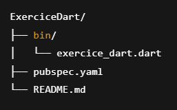

*******************************************************************************************
## Exercice 1 – Syntaxe de base
###  Partie 1 : Structures de données

-  **Classe `Book`**

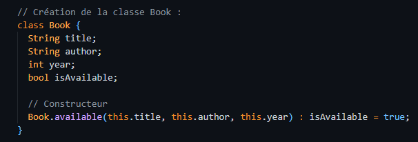

-  **Classe `Library`**

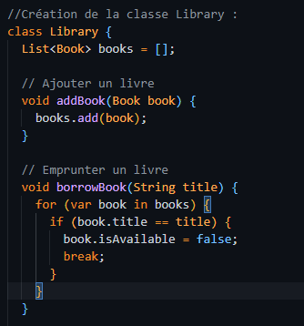

###  Partie 2 : Fonctions et opérateurs

-  **Fonction `displayBooks`**

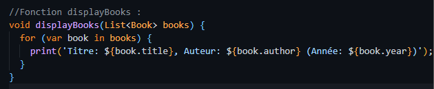 

-  **Surcharge de l’opérateur `+` dans `Library`**
Permet de fusionner deux bibliothèques.

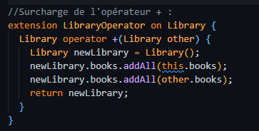

###  Partie 3 : Contrôle de flux (dans main())

    - Création de trois livres
    - Ajout à la bibliothèque
    - Emprunt d’un livre
    - Affichage des livres disponibles
    - Fusion de deux bibliothèques avec `+`

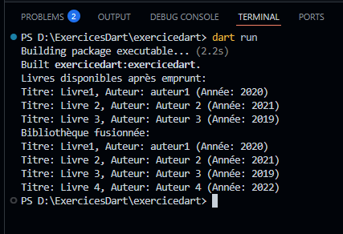

### Commentaires comparatifs
| Langage      | Similitudes avec Dart                                       | Différences avec Dart                                                                 |
|--------------|-------------------------------------------------------------|----------------------------------------------------------------------------------------|
| **Java**     | - Syntaxe orientée objet - Déclaration de classes et objets similaires | - Pas besoin de getter/setter manuels dans Dart - Dart permet l'utilisation de `final`, etc. |
| **JavaScript** | - Utilisation possible d’objets et de classes              | - Dart est typé statiquement contrairement à JS - Dart utilise des **classes réelles**, alors que JS repose sur des **prototypes** |

*******************************************************************************************
## Exercice 2 – Programmation orientée objet

###  Classe `Employe`

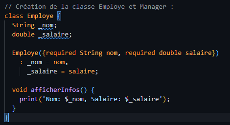 

###  Classe `Manager` (hérite de `Employe`)

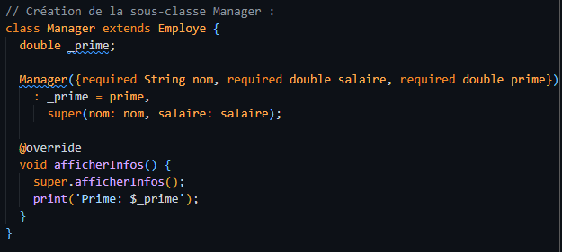

###  Dans `main()` :

- Création d’un `Employe` et un `Manager`
- Ajout à une `List<Employe>`
- Parcours et affichage (polymorphisme)

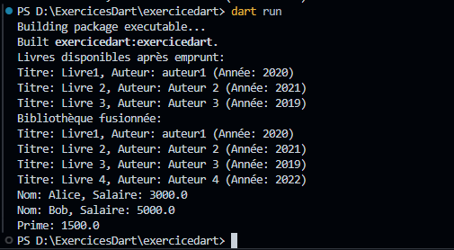

### Observations :
✔️ Héritage comme en Java :
Manager peut hériter et redéfinir les méthodes, utiliser super.

⚠️ Différence avec JavaScript :
Dart est orienté classe comme Java, alors que JS utilise des prototypes.
Dart permet aussi l'encapsulation via _nom (attributs privés).

*******************************************************************************************
## Exercice 3 – Programmation asynchrone
###  Objectif :
Simuler un appel API avec Future.delayed (2 secondes), afficher loading..., puis afficher "Données reçues" après attente.

### Implémentation :
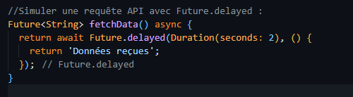 

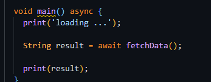 

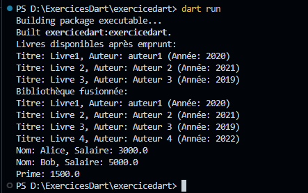

### Comparaison :
Java :
On utilise Thread.sleep() ou des ExecutorService pour la gestion de threads. Plus complexe que await.

JavaScript :
On utiliserait une Promise : Promise, async/await

*******************************************************************************************
## Conclusion
Ce projet a permis d’acquérir une bonne compréhension de Dart avant d’entamer le développement avec Flutter.
Les points clés abordés sont :

La création de classes et d’objets

La manipulation de listes

L'encapsulation, l'héritage, et le polymorphisme

La gestion asynchrone simplifiée

Ces concepts sont fondamentaux pour la création d'applications mobiles modernes et robustes.

💻 Nom : Sara EL AMRANI

🗓️ Date : Mai 2025
